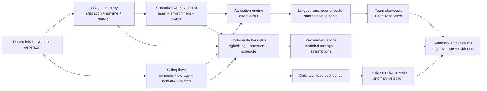

# Data Platform Cost Optimizer


An explainable, dependency-free FinOps reference for data platforms. It
generates fictional workload telemetry and billing lines, produces exact team
showback, detects robust cost anomalies, and proposes rightsizing, retention,
and non-production scheduling experiments with explicit assumptions.

> **Portfolio disclosure:** This is a self-directed synthetic demonstration.
> Every workload, team, owner, usage value, bill, anomaly, and recommendation is
> fictional. It is not connected to a cloud account or employer platform. The
> savings are simple modeled opportunities—not forecasts, commitments, or
> realized financial results.

## Engineering goals

- Attribute direct spend using canonical workload metadata rather than trusting
  incomplete billing tags alone.
- Allocate shared platform cost exactly to the cent with a deterministic
  largest-remainder algorithm.
- Reconcile total showback cost to the fictional bill with zero drift.
- Detect cost spikes using a rolling median and median absolute deviation (MAD),
  avoiding a heavy machine-learning dependency.
- Make every recommendation explain its evidence, formula, confidence, and need
  for validation.
- Preserve byte-deterministic generation and idempotent report outputs.
- Run all tests and analysis offline without cloud credentials.

## Architecture



## Quick start

Python 3.11+ is the only runtime requirement:

```bash
make demo
make test
```

Or run the stages directly:

```bash
PYTHONPATH=src python3 -m platform_cost.cli generate \
  --output data/input --seed 20260728 --days 60 --workloads 12

PYTHONPATH=src python3 -m platform_cost.cli analyze \
  --usage data/input/usage.csv \
  --billing data/input/billing.csv \
  --output reports
```

Identical inputs produce byte-identical reports.

## Reproducible sample

The default seed and 60-day, 12-workload scenario produces:

| Measured synthetic result | Value |
|---|---:|
| Total fictional bill | CAD 21,695.19 |
| Direct workload cost | CAD 20,554.29 |
| Shared cost allocated | CAD 1,140.90 |
| Showback allocation difference | CAD 0.00 |
| Teams | 4 |
| Untagged line items | 540 |
| Cost anomalies detected | 2 |
| Recommendations | 8 |
| Modeled monthly opportunity | CAD 800.39 |

Both deliberately injected W003 spikes are detected:

| Date | Actual cost | Rolling median | Threshold | Severity |
|---|---:|---:|---:|---|
| 2025-01-25 | 105.17 | 26.13 | 36.13 | HIGH |
| 2025-02-17 | 141.87 | 26.37 | 36.37 | HIGH |

See [sample_summary.json](examples/sample_summary.json) and
[sample_team_showback.csv](examples/sample_team_showback.csv). These figures are
portfolio evidence only.

## Allocation model

1. Each non-shared billing line is joined to canonical workload metadata.
2. Direct spend aggregates to the owning team.
3. Shared observability spend is weighted by each team's share of direct spend.
4. Allocations are floored to cents.
5. Remaining cents go to the largest fractional remainders with team name as a
   deterministic tie-breaker.
6. A hard assertion requires showback totals to equal billed totals exactly.

This is showback, not chargeback: it explains modeled ownership but does not post
financial transactions.

## Detection model

For each workload and day after a 14-day baseline:

```text
baseline = median(previous 14 daily costs)
MAD      = median(abs(cost - baseline))
band     = max(3 × 1.4826 × MAD, CAD 10)
alert    = actual_cost > baseline + band
```

The CAD 10 floor limits alerts from trivial fluctuations in small workloads.
Seasonality, holidays, deployments, and business events are not modeled; a real
system should add them before operational alerting.

## Recommendation assumptions

| Category | Eligibility signal | Modeled opportunity | Confidence |
|---|---|---|---|
| Rightsize compute | mean CPU p95 < 35% and memory p95 < 40% | 25% of normalized monthly compute cost | Medium |
| Optimize retention | retention > 90 days and mean storage > 500 GB | 40% of normalized monthly storage cost | Medium |
| Schedule non-prod | non-production and mean runtime > 10 h/day | 15% of normalized monthly compute cost | Low |

Every output row contains `requires_validation=true`. Before action, owners must
validate latency, concurrency, recovery, retention, compliance, reservations,
contract terms, and performance under peak load. Potential categories are
additive in this demo and may overlap; do not sum them into a budget without a
workload-level validation plan.

## Outputs

```text
reports/
├── team_showback.csv       # Direct + allocated shared spend by team
├── cost_anomalies.csv      # Explainable robust-statistic detections
├── recommendations.csv     # Evidence, action, assumptions, confidence
└── summary.json            # Reconciliation, coverage, totals, checksums
```

## Interview-defensible trade-offs

- Canonical metadata fills gaps in billing tags but tag gaps remain visible as a
  governance metric.
- Direct-cost share is a transparent shared allocation driver; request volume or
  reserved capacity consumption might be fairer for a real platform.
- MAD is robust and explainable but not seasonality-aware.
- Heuristics prioritize review candidates, not automatic infrastructure changes.
- CSV and single-node Python maximize portability; production scale would use a
  billing export, warehouse/lakehouse tables, incremental models, and a semantic
  cost layer.

See [Methodology](docs/methodology.md), the
[ADR](docs/adr/0001-explainable-finops.md), and the
[Runbook](docs/runbook.md).

## License

MIT. See [LICENSE](LICENSE).

